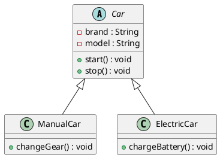
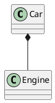
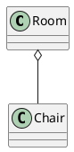
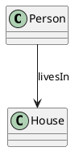
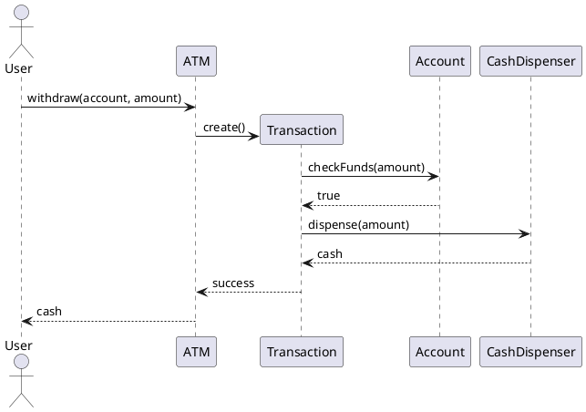
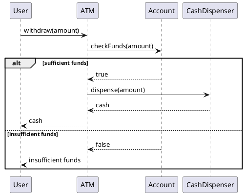
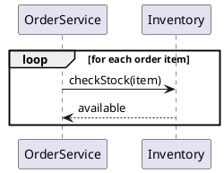

# UML Diagrams for LLD — Interview & Production Revision Notes

> **LLD goal:** Convert a problem statement into a clean object-oriented design before writing production code.
>
> This README is based on the provided Techu lecture transcript, with practical Java examples, clearer UML notation, architecture sketches, and revision-oriented additions.

---

## 1. What is UML?

**UML (Unified Modeling Language)** is a visual way to express the design of an application.

Instead of explaining an application using long paragraphs, UML helps us visually show:

- What classes/components exist
- What data and methods they contain
- How classes are related
- How objects communicate
- The order in which interactions happen

### Why UML matters in LLD

```text
Problem Statement
       │
       ▼
Identify Objects / Classes
       │
       ▼
Class Diagram
       │
       ▼
Relationships + Responsibilities
       │
       ▼
Sequence Diagram
       │
       ▼
Java / Production Code
```

A useful mental model is:

> **Class Diagram = What exists?**  
> **Sequence Diagram = What happens and in what order?**

---

# 2. Types of UML Diagrams

UML diagrams can broadly be grouped into:

```text
                         UML
                          │
             ┌────────────┴────────────┐
             │                         │
       STRUCTURAL                  BEHAVIORAL
             │                         │
       Static structure          Dynamic behavior
             │                         │
       ┌─────┴─────┐             ┌─────┴─────┐
       │           │             │           │
   Class etc.   Other         Sequence    Other
                               etc.
```

The lecture focuses primarily on two diagrams for LLD:

| Diagram | Category | Main Question |
|---|---|---|
| **Class Diagram** | Structural | What classes exist and how are they related? |
| **Sequence Diagram** | Behavioral | How do objects communicate over time? |

### Interview priority

For most LLD interviews:

1. **Class Diagram — very important**
2. **Sequence Diagram — important for complex flows**

---

# 3. Class Diagram

A class diagram represents:

- Classes
- Attributes
- Methods
- Access modifiers
- Relationships between classes

Example:

```text
┌─────────────────────────────┐
│            Car              │
├─────────────────────────────┤
│ - brand : String            │
│ - model : String            │
│ # engineCc : int            │
├─────────────────────────────┤
│ + startEngine() : void      │
│ + stopEngine() : void       │
│ + accelerate() : void       │
│ + brake() : void            │
└─────────────────────────────┘
```

---

# 4. Anatomy of a UML Class

A class is represented by a rectangle divided into three sections:

```text
┌──────────────────────┐
│      Class Name      │
├──────────────────────┤
│     Attributes       │
├──────────────────────┤
│       Methods        │
└──────────────────────┘
```

### Generic template

```text
┌──────────────────────────────────┐
│ ClassName                        │
├──────────────────────────────────┤
│ + publicField : Type             │
│ - privateField : Type            │
│ # protectedField : Type          │
├──────────────────────────────────┤
│ + publicMethod() : ReturnType    │
│ - privateMethod() : ReturnType   │
└──────────────────────────────────┘
```

### Syntax

```text
visibility name : Type
visibility method(parameters) : ReturnType
```

Example:

```text
- balance : double
+ withdraw(amount : double) : boolean
```

---

# 5. Access Modifiers in UML

| Modifier | UML Symbol | Meaning |
|---|---:|---|
| Public | `+` | Accessible from outside |
| Private | `-` | Accessible only inside the class |
| Protected | `#` | Accessible inside class and subclasses |
| Package | `~` | Accessible within package |

### Quick memory trick

```text
+  → Public
-  → Private
#  → Protected
~  → Package
```

### Java example

```java
public class BankAccount {

    private double balance;
    protected String accountType;
    public String accountNumber;

    public boolean withdraw(double amount) {
        if (amount > balance) {
            return false;
        }

        balance -= amount;
        return true;
    }
}
```

### UML

```text
┌──────────────────────────────────┐
│ BankAccount                      │
├──────────────────────────────────┤
│ - balance : double               │
│ # accountType : String           │
│ + accountNumber : String         │
├──────────────────────────────────┤
│ + withdraw(amount : double)      │
│   : boolean                      │
└──────────────────────────────────┘
```

> **LLD recommendation:** Prefer private state and expose behavior through meaningful public methods. Do not make fields public merely to make the diagram easier.

---

# 6. Concrete vs Abstract Class

## Concrete Class

A normal instantiable class.

```java
public class Car {
}
```

UML:

```text
┌─────────────┐
│     Car     │
└─────────────┘
```

## Abstract Class

An abstract class cannot normally be instantiated directly.

```java
public abstract class Vehicle {

    public abstract void start();

    public void stop() {
        System.out.println("Stopping");
    }
}
```

UML convention:

```text
┌──────────────────────┐
│      Vehicle         │
│     <<abstract>>     │
├──────────────────────┤
│ + start() : void     │
│ + stop() : void      │
└──────────────────────┘
```

Another standard UML convention is to **italicize** the abstract class/method name.

---

# 7. Relationships in Class Diagrams

The most important relationships for LLD are:

```text
Relationships
     │
     ├── Is-A  → Inheritance
     │
     └── Has-A → Association / Aggregation / Composition
```

The critical question is:

> **"Is this object another type of that object?"** → Is-A  
> **"Does this object contain/use another object?"** → Has-A

---

# 8. Inheritance — IS-A Relationship

Inheritance represents an **is-a** relationship.

Examples:

```text
Dog IS-A Animal
ElectricCar IS-A Car
ManualCar IS-A Car
```

### UML

```text
        ┌──────────────┐
        │    Vehicle   │
        └──────▲───────┘
               │
        ┌──────┴───────┐
        │              │
┌──────────────┐ ┌──────────────┐
│  ManualCar   │ │ ElectricCar  │
└──────────────┘ └──────────────┘
```

The hollow triangle points toward the **parent/base class**.

### Java

```java
class Car {
    void drive() {
        System.out.println("Driving");
    }
}

class ManualCar extends Car {
    void changeGear() {
        System.out.println("Changing gear");
    }
}

class ElectricCar extends Car {
    void chargeBattery() {
        System.out.println("Charging battery");
    }
}
```

### When inheritance makes sense

Use inheritance when the subtype genuinely satisfies the parent type:

```text
ManualCar IS-A Car       ✓
ElectricCar IS-A Car    ✓
Engine IS-A Car          ✗
```

---

# 9. Association — General Has-A / Uses Relationship

Association represents a relationship between objects/classes without necessarily implying strong ownership.

Example:

```text
Person ───────────────► House
       livesIn
```

```java
class House {
}

class Person {
    private House house;

    public Person(House house) {
        this.house = house;
    }
}
```

Think:

> "Person is related to / uses / lives in House."

The exact strength of the relationship determines whether simple association, aggregation, or composition is more appropriate.

---

# 10. Aggregation — WEAK WHOLE-PART

Aggregation represents a **whole-part relationship** where the part can independently exist outside the whole.

Classic example:

```text
       ◇──────────────►
      Room
       │
       ├──────── Sofa
       ├──────── Chair
       └──────── Bed
```

The **hollow diamond** is placed on the aggregate/whole side.

### Meaning

```text
Room HAS-A Sofa
Room HAS-A Bed
Room HAS-A Chair
```

But:

```text
Sofa can exist without Room
Bed can exist without Room
Chair can exist without Room
```

### Java

```java
class Chair {
}

class Room {
    private final List<Chair> chairs;

    public Room(List<Chair> chairs) {
        this.chairs = chairs;
    }
}
```

The chair objects can be created independently:

```java
Chair chair1 = new Chair();
Chair chair2 = new Chair();

Room room = new Room(List.of(chair1, chair2));
```

---

# 11. Composition — STRONG WHOLE-PART

Composition is a stronger ownership relationship.

Example:

```text
       ◆──────────────►
      House
       │
       ├──────── Room
       ├──────── Room
       └──────── Room
```

The **filled diamond** is placed on the owner/whole side.

The important idea:

> The lifetime/ownership of the part is strongly tied to the whole.

### Example

```java
class Room {
    private final String name;

    Room(String name) {
        this.name = name;
    }
}

class House {
    private final List<Room> rooms = new ArrayList<>();

    public House() {
        rooms.add(new Room("Living Room"));
        rooms.add(new Room("Bedroom"));
    }
}
```

Here the `House` creates and owns its `Room` objects.

---

# 12. Association vs Aggregation vs Composition

| Relationship | Strength | Independent Part? | UML |
|---|---|---|---|
| Association | General relationship | Usually yes | Line / arrow |
| Aggregation | Weak whole-part | Yes | Hollow diamond `◇` |
| Composition | Strong whole-part | No / lifecycle tied | Filled diamond `◆` |

### Easy mental model

```text
Association
A ───── B
"related to"

Aggregation
A ◇──── B
"A has B, B can live independently"

Composition
A ◆──── B
"A owns B, B's lifecycle is strongly tied to A"
```

### Important design warning

Do **not** choose composition merely because one class has another class as a field.

Ask:

1. Who owns the object?
2. Who creates it?
3. Can it meaningfully exist independently?
4. What happens to the part when the owner is destroyed?
5. Can the same part be shared elsewhere?

These questions are more useful than memorizing symbols.

---

# 13. How Composition Looks in Code

A common implementation pattern is **composition through a field/reference**.

```java
class Engine {

    void start() {
        System.out.println("Engine started");
    }
}

class Car {

    private final Engine engine;

    public Car() {
        this.engine = new Engine();
    }

    public void startCar() {
        engine.start();
    }
}
```

Architecture:

```text
┌──────────────┐
│     Car      │
│              │
│  ┌────────┐  │
│  │ Engine │  │
│  └────────┘  │
└──────────────┘
```

The important LLD idea is:

> **Favor composition over inheritance when behavior can be assembled from collaborating objects instead of forcing an artificial type hierarchy.**

---

# 14. Car Example — Complete Class Diagram

Problem:

- A `Car` has common properties.
- `ManualCar` has `changeGear()`.
- `ElectricCar` has `chargeBattery()`.

### UML

```text
                         ┌──────────────────────────┐
                         │          Car             │
                         ├──────────────────────────┤
                         │ - brand : String         │
                         │ - model : String         │
                         │ - engineCc : int         │
                         ├──────────────────────────┤
                         │ + start() : void         │
                         │ + stop() : void          │
                         │ + accelerate() : void    │
                         │ + brake() : void         │
                         └────────────▲─────────────┘
                                      │
                       ┌──────────────┴──────────────┐
                       │                             │
            ┌─────────────────────┐       ┌─────────────────────┐
            │      ManualCar      │       │     ElectricCar     │
            ├─────────────────────┤       ├─────────────────────┤
            │                     │       │                     │
            ├─────────────────────┤       ├─────────────────────┤
            │ + changeGear()      │       │ + chargeBattery()   │
            │   : void            │       │   : void            │
            └─────────────────────┘       └─────────────────────┘
```

### Java

```java
abstract class Car {
    private final String brand;
    private final String model;

    protected Car(String brand, String model) {
        this.brand = brand;
        this.model = model;
    }

    public abstract void start();

    public void stop() {
        System.out.println("Car stopped");
    }
}

class ManualCar extends Car {

    ManualCar(String brand, String model) {
        super(brand, model);
    }

    @Override
    public void start() {
        System.out.println("Manual car started");
    }

    public void changeGear() {
        System.out.println("Gear changed");
    }
}

class ElectricCar extends Car {

    ElectricCar(String brand, String model) {
        super(brand, model);
    }

    @Override
    public void start() {
        System.out.println("Electric car started");
    }

    public void chargeBattery() {
        System.out.println("Battery charging");
    }
}
```

---

# 15. Sequence Diagram

A sequence diagram represents **object interaction over time**.

It answers:

> Who calls whom, in what order, and with what message?

### Basic structure

```text
Time ↓

User              ATM              Account
 │                 │                  │
 │── withdraw() ──►│                  │
 │                 │── checkFunds() ─►│
 │                 │◄──── true ──────│
 │◄── cash ────────│                  │
 │                 │                  │
```

---

# 16. Sequence Diagram Components

The lecture covers:

1. Object
2. Lifeline
3. Activation bar
4. Synchronous message
5. Asynchronous message
6. Create message
7. Destroy message
8. Lost message
9. Found message
10. `alt`
11. `opt`
12. `loop`

---

# 17. Object / Participant

In a sequence diagram, we usually show the participating object/component at the top.

```text
┌─────────┐
│  User   │
└─────────┘
    │
    │
    │
```

Unlike a class diagram, we normally don't show all attributes and methods of the class.

Why?

Because sequence diagrams focus on **behavior**, not class structure.

---

# 18. Lifeline

A lifeline shows the existence of a participant through time.

```text
┌─────────┐
│  User   │
└─────────┘
    │
    :
    :
    :
    :
```

Conceptually:

```text
Top
 │
 │ object exists
 │
 │
 │
 ▼
Bottom
```

If an object is created later, its lifeline begins at the creation point.

---

# 19. Activation Bar

An activation bar shows when an object is actively executing a method/interaction.

```text
User             ATM
 │                │
 │───────────────►│
 │                █
 │                █
 │                █
 │                │
 │◄───────────────│
```

Think:

```text
Lifeline     = object exists
Activation   = object is executing/processing
```

> Practical UML tools may render activation bars differently; the core idea is the period during which the participant is handling an interaction.

---

# 20. Synchronous Message

A synchronous call means the caller waits for the operation to complete/return.

Example:

```text
ATM ──────► Account
           checkBalance()
ATM ◄───── Account
           balance
```

Java:

```java
double balance = account.checkBalance();
```

Conceptually:

```text
Caller
  │
  │ call
  ▼
Receiver
  │
  │ process
  │
  └──── return ───► Caller
```

Typical UML notation uses a **solid line with a filled arrowhead** for a synchronous call.

---

# 21. Asynchronous Message

With an asynchronous message, the sender does not wait for the receiver to finish before continuing.

Example:

```text
OrderService ─────► MessageQueue
                    publish(order)
```

Java-like conceptual code:

```java
queue.publish(order);
continueProcessing();
```

Typical UML notation uses an **open arrowhead**.

Real production examples:

- Kafka event publishing
- Message queues
- Event buses
- Background jobs

---

# 22. Synchronous vs Asynchronous

| Feature | Synchronous | Asynchronous |
|---|---|---|
| Caller waits? | Yes | No |
| Common example | Method call | Event/message |
| Typical use | Immediate result | Background/event processing |
| UML | Filled arrowhead | Open arrowhead |

### Mental model

```text
SYNC

A ── request ──► B
A ◄── response ─ B
A waits


ASYNC

A ── event ────► B
A continues immediately
```

---

# 23. Create Message

A create message indicates creation of a new participant/object.

```text
ATM                  Transaction
 │                       │
 │──── create() ────────►│
 │                       │
 │                       │
```

The created object's lifeline starts at the creation point.

### Java equivalent

```java
Transaction transaction = new Transaction();
```

---

# 24. Destroy Message

A destroy message indicates that an object's lifecycle ends.

Conceptually:

```text
A                  B
│                  │
│──── destroy ────►│
│                  ✕
│
```

The lifeline terminates at the destruction point.

> In garbage-collected Java, this is generally a **design/lifecycle concept**, not a direct instruction to manually free memory.

---

# 25. Lost Message

A lost message is a message whose destination is unknown/unavailable or intentionally not represented.

Conceptually:

```text
A
│
│──── message ────► ●
                    destination unknown
```

Use cases can include:

- Unmodeled external destination
- Message leaving the system boundary
- Communication whose receiver is intentionally omitted

---

# 26. Found Message

A found message is a message whose sender is unknown/unrepresented but whose receiver is known.

```text
● ─────────────► A
unknown source   known receiver
```

This can represent an external event entering the modeled system.

---

# 27. `alt` — If / Else

`alt` represents alternative flows.

Example:

```text
┌──────────────────────────────────┐
│ alt                              │
│                                  │
│ [balance >= amount]              │
│      dispenseCash()              │
│                                  │
├──────────────────────────────────┤
│ [balance < amount]               │
│      showInsufficientFunds()     │
└──────────────────────────────────┘
```

Equivalent code:

```java
if (balance >= amount) {
    dispenseCash();
} else {
    showInsufficientFunds();
}
```

---

# 28. `opt` — Optional If

`opt` represents a conditional flow with no explicit else branch.

```text
┌──────────────────────────────┐
│ opt [userHasDiscount]        │
│     applyDiscount()          │
└──────────────────────────────┘
```

Equivalent code:

```java
if (userHasDiscount) {
    applyDiscount();
}
```

---

# 29. `loop` — Repetition

`loop` represents repeated interaction.

```text
┌──────────────────────────────┐
│ loop [for each item]         │
│     processItem()            │
└──────────────────────────────┘
```

Equivalent Java:

```java
for (Item item : items) {
    processItem(item);
}
```

---

# 30. ATM Withdrawal — Complete Sequence

## Step 1 — Identify the use case

```text
User wants to withdraw cash from ATM.
```

## Step 2 — Identify participants

```text
User
ATM
Transaction
Account
CashDispenser
```

## Step 3 — Identify the flow

```text
User
 │
 │ withdraw(account, amount)
 ▼
ATM
 │
 │ create transaction
 ▼
Transaction
 │
 │ check funds
 ▼
Account
 │
 │ return result
 ▼
Transaction
 │
 │ request cash
 ▼
CashDispenser
 │
 │ dispense
 ▼
ATM
 │
 │ return cash
 ▼
User
```

---

# 31. ATM Sequence Diagram — Text UML

```text
User          ATM          Transaction       Account       CashDispenser
 │             │                │               │                │
 │ withdraw()  │                │               │                │
 │────────────►│                │               │                │
 │             │                │               │                │
 │             │── create() ───►│               │                │
 │             │                │               │                │
 │             │                │── checkFunds()►│                │
 │             │                │               │                │
 │             │                │◄──── true ────│                │
 │             │                │               │                │
 │             │◄───────────────│               │                │
 │             │                │               │                │
 │             │──── dispenseCash(amount) ───────────────────────►│
 │             │                                                   │
 │             │◄──────────────────── cash ───────────────────────│
 │             │                │               │                │
 │◄────────────│                │               │                │
 │    cash     │                │               │                │
```

---

# 32. ATM Architecture

A cleaner production-oriented interpretation is:

```text
┌──────────────┐
│     User     │
└──────┬───────┘
       │
       ▼
┌──────────────┐
│     ATM      │
│ Controller   │
└──────┬───────┘
       │
       ▼
┌─────────────────────┐
│ Withdrawal Service  │
└──────┬──────────────┘
       │
       ├──────────────► Account / Bank Service
       │
       └──────────────► Cash Dispenser
```

### Important distinction

A sequence diagram describes **one behavior/use case**.

It is not normally "the sequence diagram of the entire application."

A large application can have many use cases:

```text
ATM
 │
 ├── Withdraw Cash
 ├── Deposit Cash
 ├── Check Balance
 ├── Change PIN
 ├── Mini Statement
 └── Transfer Money
```

Each important flow may have its own sequence diagram.

---

# 33. How to Create a Class Diagram in an LLD Interview

Use this process:

```text
1. Read problem
      ↓
2. Extract nouns
      ↓
3. Convert important nouns into classes
      ↓
4. Identify attributes
      ↓
5. Identify behaviors
      ↓
6. Decide visibility
      ↓
7. Identify IS-A relationships
      ↓
8. Identify HAS-A relationships
      ↓
9. Decide aggregation/composition where meaningful
      ↓
10. Review responsibilities
```

### Example

Problem:

> Design a food ordering system.

Nouns:

```text
User
Restaurant
Menu
MenuItem
Order
Payment
Delivery
```

Possible structure:

```text
User
 │
 └──── places ───► Order
                     │
                     ├──── contains ───► OrderItem
                     │
                     └──── paid by ────► Payment

Restaurant
 │
 └──── owns ───────► Menu
                       │
                       └──── contains ─► MenuItem
```

---

# 34. How to Create a Sequence Diagram

Use this repeatable method:

```text
Problem
  ↓
Identify one use case
  ↓
Write the happy-path flow
  ↓
Identify participating objects
  ↓
Put objects left → right
  ↓
Draw lifelines
  ↓
Draw calls in chronological order
  ↓
Add returns
  ↓
Add creation/destruction if required
  ↓
Add alt / opt / loop for branching
```

### Example

Use case:

> User places an order.

```text
User
  │
  │ placeOrder()
  ▼
OrderController
  │
  │ createOrder()
  ▼
OrderService
  │
  │ validateItems()
  ▼
Restaurant
  │
  │ confirmOrder()
  ▼
PaymentService
  │
  │ charge()
  ▼
PaymentGateway
```

---

# 35. PlantUML — Practical Diagram-as-Code

For actual development, it is often easier to maintain UML using **PlantUML** instead of manually redrawing diagrams.

## Class Diagram



## Composition



## Aggregation



## Association



---

# 36. PlantUML Sequence Diagram



### Conditional flow



### Loop



---

# 37. Most Important UML Cheat Sheet

## Class

```text
┌───────────────────────┐
│ ClassName             │
├───────────────────────┤
│ - field : Type        │
├───────────────────────┤
│ + method() : Type     │
└───────────────────────┘
```

## Relationship symbols

```text
Inheritance:
Child ───────▷ Parent
             hollow triangle

Association:
A ──────────► B

Aggregation:
Whole ◇────── Part

Composition:
Whole ◆────── Part
```

## Sequence

```text
Object
  │
  │ lifeline
  │
  █ activation
  │
  │────────► synchronous call
  │
  │ - - - - ► return
  │
  │────────▷ asynchronous call
```

---

# 38. Interview Traps

## Trap 1 — Everything is inheritance

Bad design:

```text
Car
 ▲
Engine
```

This says:

```text
Engine IS-A Car
```

which is nonsense.

Better:

```text
Car ◆──── Engine
```

because:

```text
Car HAS-A Engine
```

---

## Trap 2 — Using composition everywhere

Not every field is composition.

```java
class Order {
    private User user;
}
```

This does not automatically mean:

```text
Order ◆──── User
```

Ask whether `Order` owns the lifecycle of `User`.

Usually it doesn't.

---

## Trap 3 — Confusing class and object diagrams

Class diagram:

```text
Car
```

Object:

```text
myCar : Car
```

Class diagram describes the **type/design**.

Sequence diagram usually describes **specific participating objects/components and their interactions**.

---

## Trap 4 — Making sequence diagrams enormous

Don't draw every internal method call.

Focus on interactions that help explain the use case and architecture.

---

# 39. LLD Design Principle: Composition Over Inheritance

A major practical takeaway is:

```text
Inheritance
    ↓
Rigid hierarchy
    ↓
Can become difficult to change


Composition
    ↓
Collaborating objects
    ↓
Behavior can be assembled/swapped
```

Example:

Instead of:

```text
Payment
 ├── CreditCardPayment
 ├── UPIPayment
 ├── WalletPayment
 └── NetBankingPayment
```

sometimes a strategy-based design is cleaner:

```text
                 ┌───────────────────────┐
                 │   PaymentService      │
                 └──────────┬────────────┘
                            │
                            │ HAS-A
                            ▼
                 ┌───────────────────────┐
                 │ PaymentStrategy       │
                 └──────────┬────────────┘
                            │
              ┌─────────────┼─────────────┐
              ▼             ▼             ▼
          UPI Strategy   Card Strategy  Wallet Strategy
```

Java:

```java
interface PaymentStrategy {
    void pay(double amount);
}

class UpiPayment implements PaymentStrategy {
    @Override
    public void pay(double amount) {
        System.out.println("Paid using UPI");
    }
}

class PaymentService {
    private final PaymentStrategy strategy;

    PaymentService(PaymentStrategy strategy) {
        this.strategy = strategy;
    }

    public void pay(double amount) {
        strategy.pay(amount);
    }
}
```

This is one of the most useful LLD patterns: **composition + polymorphism**.

---

# 40. A Practical LLD Architecture

A mature LLD design often evolves like this:

```text
                ┌─────────────────────┐
                │    Problem          │
                │    Statement        │
                └──────────┬──────────┘
                           │
                           ▼
                ┌─────────────────────┐
                │ Use Cases / Flows   │
                └──────────┬──────────┘
                           │
             ┌─────────────┴─────────────┐
             ▼                           ▼
     Class Diagram                 Sequence Diagram
     "What exists?"                "What happens?"
             │                           │
             └─────────────┬─────────────┘
                           ▼
                ┌─────────────────────┐
                │ Object Collaboration│
                └──────────┬──────────┘
                           │
                           ▼
                ┌─────────────────────┐
                │ SOLID + Design      │
                │ Patterns            │
                └──────────┬──────────┘
                           │
                           ▼
                ┌─────────────────────┐
                │ Production Code     │
                └─────────────────────┘
```

---

# 41. Final Revision — 2 Minute Recall

### UML

> Visual language for communicating software design.

### Structural

> Describes what exists.

### Behavioral

> Describes how things behave/interact.

### Class Diagram

> Classes + attributes + methods + relationships.

### Sequence Diagram

> Object interactions in chronological order.

### Inheritance

> **IS-A**

```text
Dog IS-A Animal
```

### Association

> General relationship.

```text
Person ──► House
```

### Aggregation

> Weak whole-part.

```text
Room ◇── Chair
```

Chair can exist independently.

### Composition

> Strong whole-part ownership.

```text
House ◆── Room
```

The lifecycle of the part is strongly tied to the whole.

### Lifeline

> Shows participant existence over time.

### Activation

> Shows active execution period.

### Sync

> Send request → wait for result.

### Async

> Send message → continue without waiting.

### `alt`

> if / else

### `opt`

> optional if

### `loop`

> repeated interaction

---

# 42. Interview Checklist

Before finalizing your LLD:

- [ ] Have I identified the important classes?
- [ ] Are responsibilities assigned to the right classes?
- [ ] Are fields encapsulated?
- [ ] Is inheritance genuinely an **IS-A** relationship?
- [ ] Is composition/association genuinely **HAS-A**?
- [ ] Can I explain why I chose composition?
- [ ] Can I explain the lifecycle of dependent objects?
- [ ] Can I draw the main use-case sequence?
- [ ] Do synchronous calls wait for responses?
- [ ] Are asynchronous events modeled appropriately?
- [ ] Are alternative/error flows represented?
- [ ] Is the diagram readable rather than overloaded?
- [ ] Can the UML be translated cleanly into code?

---

# 43. The Golden Mental Model

```text
                 LLD
                  │
        ┌─────────┴─────────┐
        │                   │
   STRUCTURE             BEHAVIOR
        │                   │
        ▼                   ▼
 CLASS DIAGRAM        SEQUENCE DIAGRAM
        │                   │
 "What exists?"       "What happens?"
        │                   │
        ▼                   ▼
 Classes              Objects
 Fields               Messages
 Methods              Calls
 Relationships        Order
        │                   │
        └─────────┬─────────┘
                  ▼
             Production Code
```

## One-line memory trick

> **Class Diagram tells you WHAT the system is made of. Sequence Diagram tells you HOW those objects collaborate to execute a use case.**

---

## Source Note

These notes are derived from the provided Techu lecture transcript on UML diagrams, class diagrams, relationships, composition, and sequence diagrams. The Java examples, PlantUML templates, architecture sketches, interview checklists, and design cautions are added as practical revision material and should be treated as supplementary to the lecture content.
