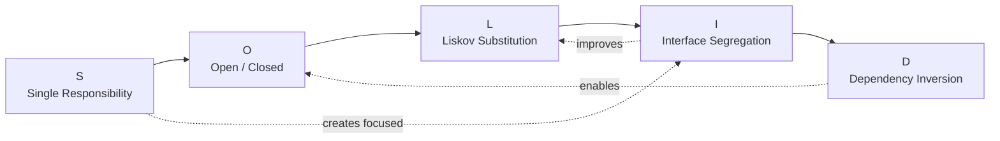
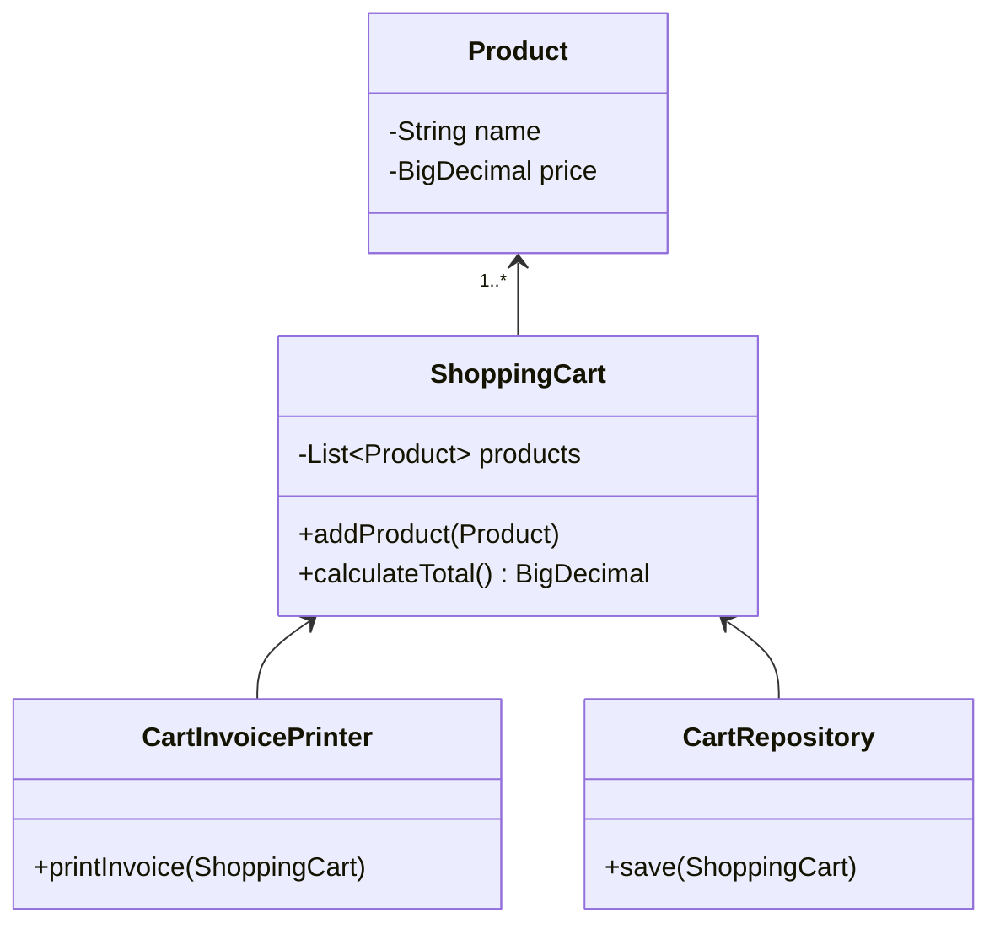
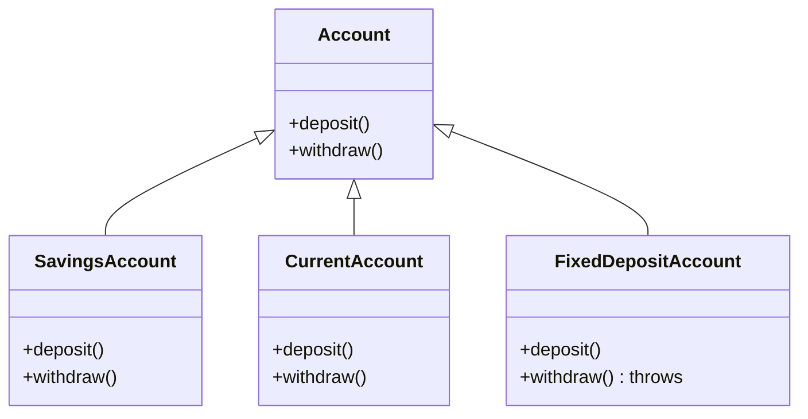
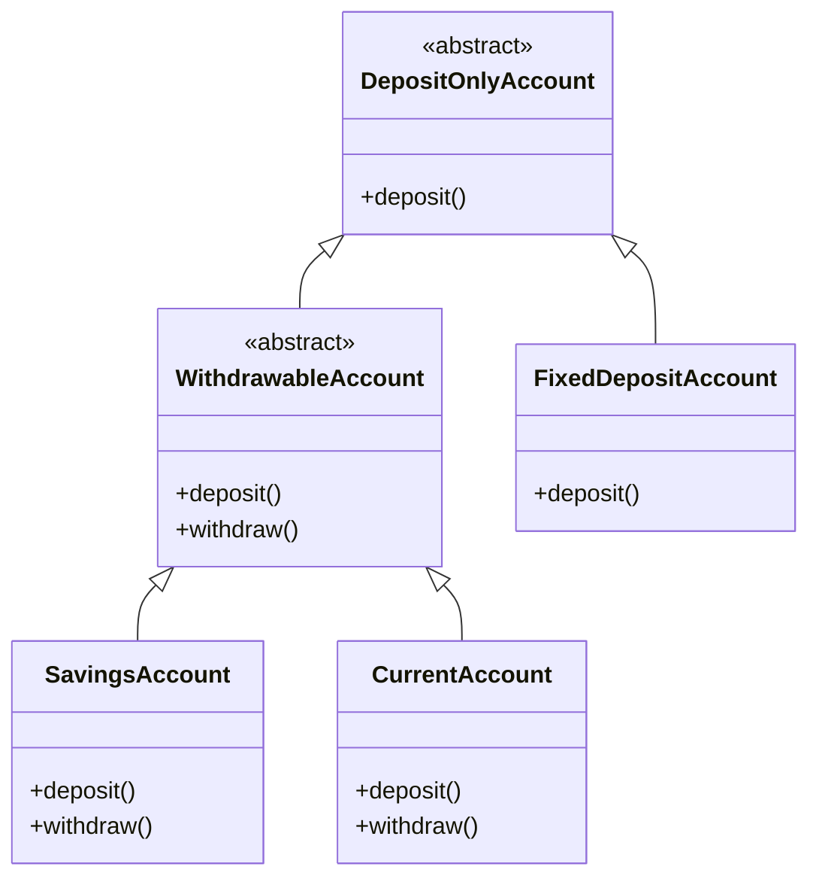
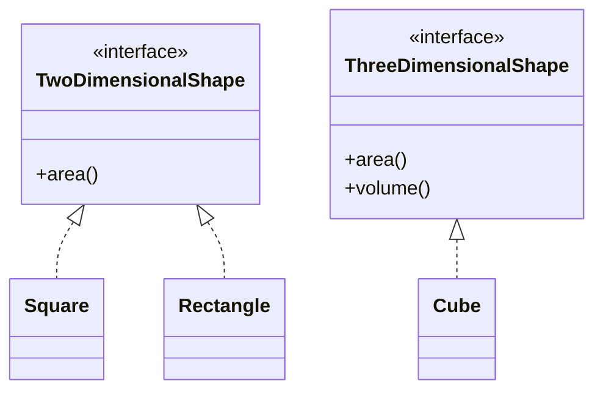
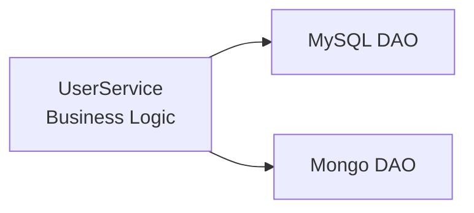

# SOLID Design Principles — LLD Revision & Interview Guide

> **Purpose:** Deep, revision-friendly notes for Low Level Design (LLD), based on the two supplied SOLID lecture transcripts, with additional Java-oriented examples, production thinking, architecture diagrams, and real-world interview questions with answers.

**Source coverage:** Part 1 covers SRP, OCP and the introduction/application of LSP. Part 2 completes LSP, then covers ISP and DIP, and closes with the important point that SOLID principles are guidelines and trade-offs rather than absolute laws.

---

## Table of Contents

1. [Why SOLID Exists](#1-why-solid-exists)
2. [SOLID at a Glance](#2-solid-at-a-glance)
3. [The Core Mental Model](#3-the-core-mental-model)
4. [S — Single Responsibility Principle](#4-s--single-responsibility-principle)
5. [O — Open/Closed Principle](#5-o--openclosed-principle)
6. [L — Liskov Substitution Principle](#6-l--liskov-substitution-principle)
7. [LSP Deep Dive: Signature, Property and Method Rules](#7-lsp-deep-dive-signature-property-and-method-rules)
8. [I — Interface Segregation Principle](#8-i--interface-segregation-principle)
9. [D — Dependency Inversion Principle](#9-d--dependency-inversion-principle)
10. [How the Five Principles Work Together](#10-how-the-five-principles-work-together)
11. [SOLID in a Spring Boot Architecture](#11-solid-in-a-spring-boot-architecture)
12. [Common Mistakes and Anti-Patterns](#12-common-mistakes-and-anti-patterns)
13. [When NOT to Over-Engineer](#13-when-not-to-over-engineer)
14. [Interview Questions — Questions First](#14-interview-questions--questions-first)
15. [Interview Answers and Reasoning](#15-interview-answers-and-reasoning)
16. [Quick Revision Sheet](#16-quick-revision-sheet)
17. [Final Checklist](#17-final-checklist)

---

# 1. Why SOLID Exists

In a real application, you do not have five or ten classes. You can have hundreds or thousands of classes.

The problem is not creating classes. The difficult problem is **managing relationships between classes as the system grows**.

Bad design tends to produce:

- tightly coupled classes
- classes doing unrelated jobs
- giant `if/else` or `switch` blocks
- changes in one feature breaking unrelated features
- subclasses that cannot safely replace their parent
- interfaces containing methods that some implementations do not need
- business logic directly coupled to databases, files, APIs, SDKs, etc.
- difficult testing and excessive mocking
- expensive debugging and risky deployments

A useful analogy from the lecture is a house where electrical wires, internet cables and pipes are all mixed together. If one wire develops a fault, identifying and replacing it becomes difficult because everything is tightly coupled.

Software has the same problem.

```text
BAD DESIGN

Business Logic
      |
      +---- MySQL
      +---- MongoDB
      +---- File System
      +---- Email
      +---- Payment SDK
      +---- PDF Library
      |
      +---- Printing
      +---- Persistence
      +---- Validation

Everything knows everything.
```

The goal of SOLID is not "write more classes".

The goal is:

> **Make change local, dependencies manageable, responsibilities clear, and abstractions meaningful.**

---

# 2. SOLID at a Glance

| Letter | Principle | Core Question |
|---|---|---|
| **S** | Single Responsibility Principle | Does this class have one coherent reason to change? |
| **O** | Open/Closed Principle | Can I add behavior without repeatedly modifying stable code? |
| **L** | Liskov Substitution Principle | Can the subtype safely stand in for the parent abstraction? |
| **I** | Interface Segregation Principle | Are clients forced to depend on methods they do not need? |
| **D** | Dependency Inversion Principle | Does high-level business logic depend on abstractions rather than concrete infrastructure? |

### The five in one picture



These principles overlap. They are not five isolated rules.

For example:

- SRP often creates smaller interfaces.
- Smaller interfaces help ISP.
- ISP can make subtype hierarchies safer under LSP.
- DIP introduces abstractions.
- Those abstractions often make OCP practical.
- OCP + DIP commonly produces a plugin/strategy-style architecture.

---

# 3. The Core Mental Model

Before memorizing definitions, understand these four concepts.

## 3.1 Responsibility

A responsibility is a coherent area of work.

Example:

```text
OrderService
    -> order business rules

OrderRepository
    -> persistence

InvoiceGenerator
    -> invoice generation

EmailSender
    -> email delivery
```

Do not interpret SRP as:

> "One class can contain only one method."

That is incorrect.

A class can have ten methods if those methods together represent **one coherent responsibility**.

---

## 3.2 Coupling

**Coupling = how strongly one component depends on another.**

```text
High coupling

OrderService ---> MySqlOrderRepository
OrderService ---> MongoOrderRepository
OrderService ---> FileOrderRepository
OrderService ---> PdfGenerator
```

Changing infrastructure can force business logic changes.

Lower coupling:

```text
OrderService ---> OrderRepository <--- MySqlOrderRepository
                                    <--- MongoOrderRepository
                                    <--- FileOrderRepository
```

The business layer knows the contract, not the implementation.

---

## 3.3 Cohesion

**Cohesion = how strongly the responsibilities inside one module belong together.**

High cohesion:

```text
InvoiceService
    generateInvoice()
    calculateTax()
    addLineItem()
    validateInvoice()
```

Low cohesion:

```text
UserManager
    createUser()
    sendEmail()
    generatePdf()
    saveToDatabase()
    calculateShipping()
    exportExcel()
```

A useful target is:

> **High cohesion + low coupling.**

---

## 3.4 Abstraction

An abstraction defines **what** is available without forcing the client to know **how** it is implemented.

```java
public interface PaymentGateway {
    PaymentResult pay(PaymentRequest request);
}
```

The business service does not need to know whether payment is handled by Stripe, Razorpay, a bank gateway, or a mock.

---

# 4. S — Single Responsibility Principle

## 4.1 Definition

> A class/module should have one responsibility and therefore one coherent reason to change.

The important word is **reason to change**.

Do not reduce SRP to "one method per class".

---

## 4.2 Bad Example: Shopping Cart Doing Everything

Imagine an e-commerce application.

```java
public class ShoppingCart {

    private List<Product> products = new ArrayList<>();

    public void addProduct(Product product) {
        products.add(product);
    }

    public BigDecimal calculateTotal() {
        return products.stream()
                .map(Product::getPrice)
                .reduce(BigDecimal.ZERO, BigDecimal::add);
    }

    public void saveToDatabase() {
        // SQL/JPA persistence logic
    }

    public void printInvoice() {
        // PDF/printer logic
    }
}
```

This class has multiple reasons to change:

1. pricing calculation changes
2. database technology changes
3. invoice format changes

That is a warning sign.

---

## 4.3 SRP Refactoring

Separate responsibilities.



### Java

```java
public class Product {
    private final String name;
    private final BigDecimal price;

    public Product(String name, BigDecimal price) {
        this.name = name;
        this.price = price;
    }

    public BigDecimal getPrice() {
        return price;
    }
}
```

```java
public class ShoppingCart {

    private final List<Product> products = new ArrayList<>();

    public void addProduct(Product product) {
        products.add(product);
    }

    public BigDecimal calculateTotal() {
        return products.stream()
                .map(Product::getPrice)
                .reduce(BigDecimal.ZERO, BigDecimal::add);
    }

    public List<Product> getProducts() {
        return List.copyOf(products);
    }
}
```

```java
public class CartInvoicePrinter {

    public void printInvoice(ShoppingCart cart) {
        System.out.println("Invoice total: " + cart.calculateTotal());
    }
}
```

```java
public class CartRepository {

    public void save(ShoppingCart cart) {
        // Persistence responsibility only.
    }
}
```

### Why this is better

```text
ShoppingCart
    |
    +-- pricing/cart behavior

CartInvoicePrinter
    |
    +-- invoice presentation

CartRepository
    |
    +-- persistence
```

If the database changes from MySQL to MongoDB, the cart's pricing logic should not change.

If the invoice changes from PDF to HTML, cart logic should not change.

---

## 4.4 SRP Does NOT Mean One Method

Bad interpretation:

```java
class Calculator {
    add();
}
```

This is not automatically "better SOLID".

A class can legitimately contain:

```java
class ShoppingCart {

    addProduct()
    removeProduct()
    updateQuantity()
    calculateSubtotal()
    calculateDiscount()
    calculateTax()
}
```

All of these may belong to the responsibility:

> **Manage shopping-cart pricing/state.**

The question is not:

> "How many methods?"

The question is:

> "Do these methods belong to one coherent responsibility?"

---

## 4.5 Real-World Spring Boot Example

Bad:

```java
@Service
public class UserService {

    public void register(User user) {
        validate(user);
        userRepository.save(user);
        emailClient.sendWelcomeEmail(user);
        pdfGenerator.generateProfile(user);
        auditRepository.saveAudit(user);
    }
}
```

This may be too many responsibilities.

Possible decomposition:

```text
UserRegistrationService
        |
        +--> UserValidator
        +--> UserRepository
        +--> NotificationService
        +--> AuditService
```

The service can still orchestrate the workflow. SRP does **not** mean every line must live in a different class.

---

## 4.6 SRP Interview Test

Ask:

> "If requirement X changes, which class changes?"

If one class changes for many unrelated business reasons, investigate SRP.

---

# 5. O — Open/Closed Principle

## 5.1 Definition

> Software entities should be open for extension but closed for modification.

Meaning:

- **Open for extension:** new behavior can be added.
- **Closed for modification:** existing stable code should not need repeated edits for every new variation.

This does **not** mean "never modify existing code". Bugs and legitimate requirement changes obviously require modifications.

The real goal is to avoid a design where every new variation forces changes to central stable logic.

---

## 5.2 Bad Example: Persistence Switch

```java
public class ShoppingCartStorage {

    public void save(ShoppingCart cart, String type) {

        if ("SQL".equals(type)) {
            // SQL logic
        } else if ("MONGO".equals(type)) {
            // Mongo logic
        } else if ("FILE".equals(type)) {
            // File logic
        }
    }
}
```

Tomorrow:

```text
Cassandra
Redis
DynamoDB
S3
```

The class keeps growing.

```text
NEW FEATURE
    |
    v
Modify old class
    |
    v
Add another if/else
    |
    v
Regression risk
```

---

## 5.3 OCP with Abstraction + Inheritance + Polymorphism

Introduce a contract.

```java
public interface Persistence {
    void save(ShoppingCart cart);
}
```

Implementations:

```java
public class SqlPersistence implements Persistence {

    @Override
    public void save(ShoppingCart cart) {
        System.out.println("Saving cart to SQL");
    }
}
```

```java
public class MongoPersistence implements Persistence {

    @Override
    public void save(ShoppingCart cart) {
        System.out.println("Saving cart to MongoDB");
    }
}
```

```java
public class FilePersistence implements Persistence {

    @Override
    public void save(ShoppingCart cart) {
        System.out.println("Saving cart to file");
    }
}
```

Now:

```java
public class CartService {

    private final Persistence persistence;

    public CartService(Persistence persistence) {
        this.persistence = persistence;
    }

    public void saveCart(ShoppingCart cart) {
        persistence.save(cart);
    }
}
```

Tomorrow Cassandra arrives:

```java
public class CassandraPersistence implements Persistence {

    @Override
    public void save(ShoppingCart cart) {
        System.out.println("Saving cart to Cassandra");
    }
}
```

`CartService` does not need to know Cassandra exists.

---

## 5.4 Architecture

```mermaid
flowchart TB
    CartService["CartService\nHigh-level logic"]
    Persistence["Persistence\n<<interface>>"]

    SQL["SqlPersistence"]
    Mongo["MongoPersistence"]
    File["FilePersistence"]
    Cassandra["CassandraPersistence"]

    CartService --> Persistence
    SQL ..|> Persistence
    Mongo ..|> Persistence
    File ..|> Persistence
    Cassandra ..|> Persistence
```

The important point:

```text
Before:

CartService ---> SQL
            ---> Mongo
            ---> File

After:

CartService ---> Persistence <--- SQL
                              <--- Mongo
                              <--- File
                              <--- Cassandra
```

---

## 5.5 OCP and Strategy Pattern

A very common implementation of OCP is the **Strategy Pattern**.

```java
public interface DiscountStrategy {
    BigDecimal calculateDiscount(BigDecimal amount);
}
```

```java
public class RegularDiscount implements DiscountStrategy {
    public BigDecimal calculateDiscount(BigDecimal amount) {
        return amount.multiply(new BigDecimal("0.05"));
    }
}
```

```java
public class PremiumDiscount implements DiscountStrategy {
    public BigDecimal calculateDiscount(BigDecimal amount) {
        return amount.multiply(new BigDecimal("0.15"));
    }
}
```

Business service:

```java
public class PricingService {

    private final DiscountStrategy strategy;

    public PricingService(DiscountStrategy strategy) {
        this.strategy = strategy;
    }

    public BigDecimal finalPrice(BigDecimal amount) {
        return amount.subtract(strategy.calculateDiscount(amount));
    }
}
```

Adding a new discount strategy does not require adding another branch to `PricingService`.

---

## 5.6 OCP vs Overengineering

This is important.

Do **not** create an interface for every class just because SOLID says abstraction.

If the system has:

```java
class StringNormalizer {
    String normalize(String input) { ... }
}
```

and there is no meaningful variation, adding:

```java
interface StringNormalizerContract
```

may add ceremony without reducing change risk.

Use abstraction where variation or dependency boundaries actually matter.

---

# 6. L — Liskov Substitution Principle

## 6.1 Definition

> Subtypes should be substitutable for their base types.

In practical terms:

> If client code is written against the parent abstraction, replacing the parent object with a valid child object should not cause the client to break its expected behavior.

The lecture uses the classic idea:

```text
Client expects A
        |
        v
Can safely receive B where B extends A
        |
        v
Client's assumptions remain valid
```

Inheritance by itself does **not** guarantee LSP.

---

# 7. LSP Deep Dive: Signature, Property and Method Rules

The lecture highlights three major groups of LSP constraints:

1. Signature rules
2. Property rules
3. Method/behavior rules

---

## 7.1 Signature Rule

A method signature consists conceptually of:

```text
method name
+ parameters
+ return type
```

Different languages have different technical rules around overriding, but the design-level LSP idea is broader:

> A subtype must honor the contract expected by clients.

### Parameter rule

A subtype should not arbitrarily require **more specific inputs** than the parent contract allowed.

Conceptually:

```text
Parent accepts: Animal
Child should not suddenly require: Dog only
```

Why?

Suppose the client has:

```java
void process(Animal animal)
```

The client is entitled to pass any valid `Animal`.

If the subtype secretly requires `Dog`, the child is not a safe replacement.

---

## 7.2 Return Type Rule

A subtype should not return something that violates the parent contract.

Covariant returns are a classic valid case.

```java
class Animal {}

class Dog extends Animal {}

class AnimalFactory {
    Animal create() {
        return new Animal();
    }
}

class DogFactory extends AnimalFactory {
    @Override
    Dog create() {
        return new Dog();
    }
}
```

`Dog` is narrower/more specific than `Animal`, while still satisfying code expecting an `Animal`.

This is called a **covariant return type**.

---

## 7.3 Exception Rule

A subtype must not surprise clients with incompatible failure behavior.

Example contract:

```java
interface UserLoader {
    User load(String id);
}
```

If the parent contract guarantees that a known missing user produces a documented `UserNotFoundException`, a subtype should not silently turn that contract into an unrelated failure mode.

In Java specifically, checked-exception overriding has compiler-enforced rules. Unchecked exceptions are not similarly restricted by the compiler, but they can still violate the behavioral contract.

**Interview point:**

> Compiler legality is not the same thing as LSP correctness.

---

# 7.4 Property Rule — Class Invariants

An **invariant** is a rule that should remain true for valid objects.

Example:

```text
BankAccount invariant:
balance >= 0
```

Parent:

```java
public class BankAccount {

    protected BigDecimal balance;

    public BankAccount(BigDecimal initialBalance) {
        if (initialBalance.signum() < 0) {
            throw new IllegalArgumentException("Balance cannot be negative");
        }
        this.balance = initialBalance;
    }

    public void withdraw(BigDecimal amount) {
        if (amount.signum() < 0) {
            throw new IllegalArgumentException("Amount cannot be negative");
        }

        if (amount.compareTo(balance) > 0) {
            throw new IllegalStateException("Insufficient funds");
        }

        balance = balance.subtract(amount);
    }
}
```

Invariant:

```text
balance >= 0
```

A child that allows:

```java
balance = balance.subtract(amount);
```

without checking the balance could create:

```text
balance = -100
```

That breaks the parent's invariant.

---

# 7.5 History Constraint

The second important property idea is the **history constraint**.

A subtype should not invalidate assumptions about the object's allowed state transitions.

Suppose the parent account contract says:

```text
withdrawal is supported
```

Then this subtype is suspicious:

```java
public class FixedDepositAccount extends BankAccount {

    @Override
    public void withdraw(BigDecimal amount) {
        throw new UnsupportedOperationException(
            "Withdrawal not allowed"
        );
    }
}
```

If client code expects every `BankAccount` to support withdrawal, this child is not a safe substitute.

This is the same fundamental issue shown in the lecture's fixed-deposit example.

---

# 7.6 The Classic Bad Hierarchy



Client:

```java
public void process(List<Account> accounts) {

    for (Account account : accounts) {
        account.deposit();
        account.withdraw();
    }
}
```

This code is valid from a type-system perspective.

But if the list contains `FixedDepositAccount`, the client gets an unexpected exception.

The abstraction is wrong.

---

# 7.7 Correcting the Hierarchy

Instead of forcing every account to support withdrawal:



Now clients can express the actual capability:

```java
void processWithdrawals(List<WithdrawableAccount> accounts) {
    for (WithdrawableAccount account : accounts) {
        account.deposit();
        account.withdraw();
    }
}
```

And:

```java
void processDeposits(List<DepositOnlyAccount> accounts) {
    for (DepositOnlyAccount account : accounts) {
        account.deposit();
    }
}
```

No exception-driven type checking is required.

---

# 7.8 Method Rule — Preconditions and Postconditions

A very useful formal mental model is:

```text
Parent contract:

Precondition  -> what client must provide
Postcondition -> what method guarantees
Invariant     -> what remains true for the object
```

For a valid subtype:

### Preconditions

Do not make them stronger.

```text
Parent:
amount > 0

Bad child:
amount > 1000
```

The child rejects valid inputs that the parent accepted.

### Postconditions

Do not weaken them.

```text
Parent:
withdraw(100) guarantees balance decreases by 100

Bad child:
withdraw(100) sometimes does nothing
```

The child fails to provide what clients were promised.

### Invariants

Do not break them.

```text
Parent:
balance >= 0

Bad child:
balance may become -500
```

---

# 7.9 A Compact LSP Formula

Think:

```text
Subtype must preserve:

Parent preconditions
Parent postconditions
Parent invariants
Parent observable behavioral contract
```

A strong interview statement:

> "Inheritance expresses an is-a relationship, but LSP asks whether that is-a relationship is behaviorally substitutable."

---

# 8. I — Interface Segregation Principle

## 8.1 Definition

> Clients should not be forced to depend on methods they do not use.

Or, as a practical design rule:

> Prefer small, client-specific interfaces over one large general-purpose interface.

---

# 8.2 Bad Example: Fat Shape Interface

Suppose:

```java
public interface Shape {
    double area();
    double volume();
}
```

Now:

```java
public class Square implements Shape {

    @Override
    public double area() {
        return 10 * 10;
    }

    @Override
    public double volume() {
        throw new UnsupportedOperationException();
    }
}
```

This is a design smell.

A square does not have a volume.

The interface is forcing an irrelevant method onto the implementation.

---

# 8.3 ISP Refactoring

Split capabilities.

```java
public interface TwoDimensionalShape {
    double area();
}
```

```java
public interface ThreeDimensionalShape {
    double area();
    double volume();
}
```

Implementations:

```java
public class Square implements TwoDimensionalShape {

    @Override
    public double area() {
        return 100;
    }
}
```

```java
public class Rectangle implements TwoDimensionalShape {

    @Override
    public double area() {
        return 10 * 20;
    }
}
```

```java
public class Cube implements ThreeDimensionalShape {

    @Override
    public double area() {
        return 6 * 10 * 10;
    }

    @Override
    public double volume() {
        return 10 * 10 * 10;
    }
}
```

---

## 8.4 Architecture



No class is forced to implement a meaningless operation.

---

# 8.5 ISP in Spring Boot

Bad:

```java
public interface UserOperations {

    void createUser(User user);

    void updateUser(User user);

    void deleteUser(Long id);

    void sendEmail(String email);

    void exportPdf(Long id);

    void generateReport();
}
```

A class implementing this may need to provide methods irrelevant to its client.

Better:

```java
public interface UserCommandService {
    void createUser(User user);
    void updateUser(User user);
    void deleteUser(Long id);
}
```

```java
public interface UserNotificationService {
    void sendWelcomeEmail(User user);
}
```

```java
public interface UserReportService {
    byte[] generateReport(Long id);
}
```

Now consumers depend only on the capability they require.

---

# 8.6 ISP vs SRP

They are related but different.

### SRP asks:

> "Does this class have too many responsibilities?"

### ISP asks:

> "Does this interface force a client/implementation to depend on things it does not need?"

Example:

```text
One huge interface
        |
        +-- Method A
        +-- Method B
        +-- Method C
        +-- Method D
```

Even if each implementation class has carefully organized code, the interface itself may still violate ISP.

---

# 9. D — Dependency Inversion Principle

## 9.1 Definition

> High-level modules should not depend directly on low-level modules. Both should depend on abstractions.

And:

> Abstractions should not depend on details. Details should depend on abstractions.

---

# 9.2 What is a High-Level Module?

A high-level module contains **business logic**.

Examples:

```text
OrderService
PaymentService
UserRegistrationService
LoanApprovalService
```

---

# 9.3 What is a Low-Level Module?

A low-level module deals with technical details or external systems.

Examples:

```text
MySQL repository
Mongo repository
File storage
SMTP client
Kafka producer
Redis client
External REST API client
Payment SDK
```

---

# 9.4 Bad Dependency Direction



Example:

```java
public class UserService {

    private final MySqlDatabase mysql;
    private final MongoDatabase mongo;

    public UserService(MySqlDatabase mysql,
                       MongoDatabase mongo) {
        this.mysql = mysql;
        this.mongo = mongo;
    }

    public void storeUser(String user) {
        mysql.save(user);
        mongo.save(user);
    }
}
```

Now imagine Mongo is replaced by Cassandra.

You must modify `UserService`.

That means infrastructure details have leaked into business logic.

---

# 9.5 DIP Solution

Introduce an abstraction:

```java
public interface UserRepository {
    void save(User user);
}
```

Implementations:

```java
@Repository
public class MySqlUserRepository implements UserRepository {

    @Override
    public void save(User user) {
        // SQL persistence
    }
}
```

```java
@Repository
public class MongoUserRepository implements UserRepository {

    @Override
    public void save(User user) {
        // Mongo persistence
    }
}
```

Business logic:

```java
@Service
public class UserService {

    private final UserRepository repository;

    public UserService(UserRepository repository) {
        this.repository = repository;
    }

    public void storeUser(User user) {
        repository.save(user);
    }
}
```

Architecture:

```mermaid
flowchart TB
    Service["UserService\nHIGH-LEVEL BUSINESS LOGIC"]
    Repo["UserRepository\nABSTRACTION"]
    SQL["MySqlUserRepository\nLOW-LEVEL DETAIL"]
    Mongo["MongoUserRepository\nLOW-LEVEL DETAIL"]
    Cassandra["CassandraUserRepository\nLOW-LEVEL DETAIL"]

    Service --> Repo
    SQL ..|> Repo
    Mongo ..|> Repo
    Cassandra ..|> Repo
```

Now `UserService` does not care which database implementation is used.

---

# 9.6 Dependency Injection vs Dependency Inversion

These terms are related but NOT identical.

### Dependency Inversion Principle

A **design principle**:

```text
High-level logic
      |
      v
Abstraction
      ^
      |
Low-level implementation
```

### Dependency Injection

A **technique** for supplying a dependency from outside.

Constructor injection:

```java
public UserService(UserRepository repository) {
    this.repository = repository;
}
```

Spring can provide the implementation.

So:

```text
DIP = architectural/design principle

DI = mechanism/technique for supplying dependencies
```

Do not say in an interview:

> "DIP and DI are the same."

They are not.

---

# 9.7 Why Constructor Injection Is Usually Preferred

```java
@Service
public class UserService {

    private final UserRepository repository;

    public UserService(UserRepository repository) {
        this.repository = repository;
    }
}
```

Benefits:

- dependency is explicit
- object cannot exist without required dependency
- fields can be `final`
- easier unit testing
- no hidden dependency through setters
- aligns naturally with DIP

Test:

```java
@Test
void shouldStoreUser() {

    UserRepository repository = mock(UserRepository.class);

    UserService service = new UserService(repository);

    User user = new User("Amit");

    service.storeUser(user);

    verify(repository).save(user);
}
```

---

# 9.8 DIP and OCP Relationship

A very important connection:

> **If OCP is the target, DIP is frequently part of the solution.**

Without abstraction:

```text
Service ---> MySQL
```

Adding another database often requires modifying the service.

With abstraction:

```text
Service ---> Repository <--- MySQL
                         <--- Mongo
                         <--- Cassandra
```

New implementations can be added without changing the business service.

This is why SOLID principles are interconnected.

---

# 10. How the Five Principles Work Together

Consider an e-commerce checkout system.

```mermaid
flowchart LR
    Controller["CheckoutController"]
    Service["CheckoutService\nBusiness Rules"]
    Payment["PaymentGateway\ninterface"]
    Inventory["InventoryService\ninterface"]
    OrderRepo["OrderRepository\ninterface"]
    Notification["NotificationSender\ninterface"]

    Stripe["StripePaymentGateway"]
    Razorpay["RazorpayPaymentGateway"]
    SqlRepo["SqlOrderRepository"]
    MongoRepo["MongoOrderRepository"]
    Email["EmailNotificationSender"]
    Sms["SmsNotificationSender"]

    Controller --> Service

    Service --> Payment
    Service --> Inventory
    Service --> OrderRepo
    Service --> Notification

    Stripe ..|> Payment
    Razorpay ..|> Payment

    SqlRepo ..|> OrderRepo
    MongoRepo ..|> OrderRepo

    Email ..|> Notification
    Sms ..|> Notification
```

### Where SOLID appears

**SRP**

```text
CheckoutService
PaymentGateway
OrderRepository
NotificationSender
```

have distinct responsibilities.

**OCP**

Add:

```text
PayPalPaymentGateway
```

without changing checkout business logic.

**LSP**

Any valid `PaymentGateway` implementation must behave according to the gateway contract.

**ISP**

Payment, inventory, persistence and notification are separate client-specific abstractions.

**DIP**

`CheckoutService` depends on interfaces rather than concrete infrastructure.

---

# 11. SOLID in a Spring Boot Architecture

A practical architecture:

```mermaid
flowchart TB
    API["REST Controller"]
    APP["Application / Use Case Service"]
    DOMAIN["Domain Model / Business Rules"]

    REPO["Repository Interfaces"]
    PAY["Payment Interfaces"]
    NOTIFY["Notification Interfaces"]

    SQL["JPA / SQL Adapter"]
    MONGO["Mongo Adapter"]
    PAYMENT["External Payment Adapter"]
    EMAIL["Email Adapter"]
    KAFKA["Kafka Adapter"]

    API --> APP
    APP --> DOMAIN
    APP --> REPO
    APP --> PAY
    APP --> NOTIFY

    SQL ..|> REPO
    MONGO ..|> REPO
    PAYMENT ..|> PAY
    EMAIL ..|> NOTIFY
    KAFKA ..|> NOTIFY
```

A typical package structure:

```text
com.example.order
|
+-- controller
|     +-- OrderController.java
|
+-- application
|     +-- OrderService.java
|
+-- domain
|     +-- Order.java
|     +-- OrderItem.java
|
+-- port
|     +-- OrderRepository.java
|     +-- PaymentGateway.java
|     +-- NotificationSender.java
|
+-- adapter
|     +-- persistence
|     |      +-- JpaOrderRepository.java
|     |
|     +-- payment
|     |      +-- StripePaymentGateway.java
|     |
|     +-- notification
|            +-- EmailNotificationSender.java
```

This resembles the dependency direction encouraged by DIP and is closely related to Hexagonal/Clean Architecture ideas.

---

# 12. Common Mistakes and Anti-Patterns

## 12.1 "SRP means one method per class"

Wrong.

Correct:

```text
One coherent responsibility
```

not:

```text
Exactly one method
```

---

## 12.2 "Every class must have an interface"

Wrong.

An interface is useful when:

- multiple implementations are expected
- a dependency boundary matters
- testing benefits from substitution
- external infrastructure needs isolation
- the domain naturally expresses a capability/contract

Do not create interfaces mechanically.

---

## 12.3 Giant switch for every implementation

```java
switch (type) {
    case SQL:
    case MONGO:
    case FILE:
    case CASSANDRA:
}
```

A switch is not automatically bad.

The smell appears when:

- every new implementation requires modifying central logic
- the switch becomes huge
- business logic becomes aware of infrastructure details

---

## 12.4 LSP Fixed by `instanceof`

Bad:

```java
if (account instanceof FixedDepositAccount) {
    // don't withdraw
} else {
    account.withdraw();
}
```

This means the client knows concrete subclasses.

You have pushed subtype knowledge into the client.

That defeats the abstraction and commonly creates OCP/DIP problems.

Prefer a better abstraction.

---

## 12.5 Throwing `UnsupportedOperationException`

This is a major LSP/ISP smell.

```java
@Override
public void withdraw() {
    throw new UnsupportedOperationException();
}
```

Sometimes such a method is legitimate for an intentionally partial API, but in a subtype hierarchy it often means:

> "The parent contract promised something this child cannot actually provide."

Reconsider the hierarchy.

---

## 12.6 Giant Interfaces

```java
interface EverythingService {
    create();
    update();
    delete();
    exportPdf();
    sendEmail();
    processPayment();
    generateReport();
}
```

This is usually a candidate for ISP and SRP review.

---

## 12.7 DIP Misunderstood as "Use Interfaces Everywhere"

DIP is about **dependency direction**, not interface quantity.

This:

```text
Business Logic ---> Concrete Database
```

is the issue.

This:

```text
Business Logic ---> Database Abstraction <--- Concrete Database
```

is the useful inversion.

---

# 13. When NOT to Over-Engineer

The lecture makes an important point:

> SOLID principles are principles, not absolute laws.

Real systems involve trade-offs.

Suppose a tiny application has:

```java
class FileUserRepository {
    void save(User user) {}
}
```

If there is no realistic variation and no architectural boundary, introducing five interfaces and ten adapter classes may be unnecessary.

Ask:

```text
Does this abstraction reduce change risk?
        |
        +-- YES -> consider it
        |
        +-- NO  -> it may be ceremony
```

### Practical trade-off

```text
More abstraction
      |
      +--> easier substitution
      +--> easier testing
      +--> extension points
      |
      +--> more classes
      +--> more indirection
      +--> more cognitive load
```

The goal is not:

> "Maximum SOLID"

The goal is:

> **A design whose complexity is justified by the business and technical change it needs to support.**

---

# 14. Interview Questions — Questions First

## Beginner → Intermediate

### Q1. What is SOLID?

### Q2. Why do we need SOLID principles?

### Q3. Explain SRP with a real-world example.

### Q4. Does SRP mean one method per class?

### Q5. What is the difference between cohesion and coupling?

### Q6. Explain OCP.

### Q7. Does OCP mean we should never modify existing code?

### Q8. How do abstraction and polymorphism help OCP?

### Q9. Explain LSP in your own words.

### Q10. Is inheritance enough to satisfy LSP?

### Q11. What is the fixed-deposit-account problem in LSP?

### Q12. What is an invariant?

### Q13. What is a history constraint?

### Q14. What are preconditions and postconditions?

### Q15. What is a covariant return type?

### Q16. Explain ISP with the Shape example.

### Q17. What is a fat interface?

### Q18. How is ISP different from SRP?

### Q19. Explain DIP.

### Q20. What is the difference between DIP and dependency injection?

---

## Real-World Scenario Questions

### Q21. Your `OrderService` directly uses `MySqlOrderRepository`. Tomorrow the company wants MongoDB. What design problem do you see?

### Q22. You have `PaymentService` with a 500-line `switch(paymentType)`. How would you redesign it?

### Q23. A parent `Bird` has `fly()`. `Penguin extends Bird`, but penguins cannot fly. Which SOLID principle is at risk and how would you redesign it?

### Q24. A `Printer` interface contains `print()`, `scan()`, `fax()` and `staple()`. A basic printer supports only printing. What is wrong?

### Q25. A `UserService` validates users, saves them, sends emails, generates PDFs and writes audit logs. Which design principle should you investigate?

### Q26. A subclass accepts only positive numbers while the parent accepted all integers. Is that safe substitution?

### Q27. A parent method guarantees a non-null result, but a child returns `null`. What kind of LSP issue is this?

### Q28. A child class throws `UnsupportedOperationException` from a parent method. Is that automatically an LSP violation?

### Q29. You have `NotificationService` directly coupled to SMTP. You later need Kafka and SMS. How would DIP help?

### Q30. Your team creates an interface for every class. Is that good SOLID design?

---

## Senior-Level Design Questions

### Q31. How do SOLID principles interact with each other?

### Q32. Can following SOLID too aggressively make a system worse?

### Q33. How would you identify SRP violations in a large codebase?

### Q34. How does DIP help unit testing?

### Q35. How do you design an extensible payment system using SOLID?

### Q36. How can you identify an LSP violation before runtime?

### Q37. What is the relationship between DIP and OCP?

### Q38. Is a large interface always an ISP violation?

### Q39. How would you refactor a legacy service without breaking production behavior?

### Q40. Give an example where intentionally violating a SOLID principle can be a reasonable trade-off.

---

# 15. Interview Answers and Reasoning

## Answer 1 — What is SOLID?

SOLID is a group of five object-oriented design principles:

```text
S -> Single Responsibility
O -> Open/Closed
L -> Liskov Substitution
I -> Interface Segregation
D -> Dependency Inversion
```

They help manage complexity, reduce coupling, make behavior easier to extend and improve maintainability.

Do not claim that SOLID guarantees bug-free software. It does not.

---

## Answer 2 — Why do we need SOLID?

Because large software systems change.

If one change requires modifications in ten unrelated modules, the system has high change coupling.

SOLID tries to make changes more local and predictable.

---

## Answer 3 — SRP

A class should have one coherent responsibility and one major reason to change.

Bad:

```text
InvoiceService
    calculate invoice
    save database
    send email
    generate PDF
```

Better:

```text
InvoiceCalculator
InvoiceRepository
EmailSender
PdfGenerator
```

The key is not number of methods; it is responsibility boundaries.

---

## Answer 4 — Does SRP mean one method?

No.

This is a common interview trap.

A class may contain many methods if all of them support the same responsibility.

---

## Answer 5 — Cohesion vs Coupling

```text
Cohesion = relationship among things inside one module.

Coupling = dependency between different modules.
```

Desired:

```text
HIGH COHESION
LOW COUPLING
```

---

## Answer 6 — OCP

Software should be designed so new variations can often be added through extension rather than repeated modification of stable central code.

Example:

```java
interface PaymentGateway {
    void pay(PaymentRequest request);
}
```

Then:

```text
StripePaymentGateway
RazorpayPaymentGateway
PayPalPaymentGateway
```

can be added independently.

---

## Answer 7 — Does OCP mean never modify code?

No.

It is an engineering guideline.

Bug fixes, requirement changes, refactoring and contract changes may require modifying existing code.

OCP is about avoiding unnecessary modification of stable code whenever new variants are introduced.

---

## Answer 8 — Abstraction + Polymorphism + OCP

```text
Interface
    |
    +---- Implementation A
    +---- Implementation B
    +---- Implementation C
```

Client:

```java
PaymentGateway gateway;
gateway.pay(request);
```

The client calls the same contract while runtime polymorphism selects the implementation.

---

## Answer 9 — LSP

If code expects a parent abstraction, a valid child should be usable in that position without violating the expectations of the client.

Short version:

> **A subtype must preserve the behavioral contract of its parent.**

---

## Answer 10 — Is inheritance enough for LSP?

No.

Inheritance gives a structural relationship.

LSP requires **behavioral substitutability**.

A class can compile perfectly and still violate LSP.

---

## Answer 11 — Fixed Deposit Account

If:

```java
Account {
    deposit();
    withdraw();
}
```

and:

```java
FixedDepositAccount extends Account
```

but:

```java
withdraw() {
    throw new UnsupportedOperationException();
}
```

then code expecting every `Account` to support withdrawal can break.

The better design is to model capabilities separately:

```text
DepositOnlyAccount
WithdrawableAccount
```

---

## Answer 12 — Invariant

A condition that must remain true for every valid object.

Example:

```text
BankAccount.balance >= 0
```

A subtype that permits negative balances can violate the parent contract.

---

## Answer 13 — History Constraint

A subtype should not violate assumptions about valid state transitions established by the parent.

If the parent account historically guarantees withdrawal is supported, a child that makes withdrawal impossible can violate the contract.

---

## Answer 14 — Preconditions and Postconditions

### Precondition

What must be true before the operation.

```text
withdraw(amount)
requires amount > 0
```

### Postcondition

What the operation guarantees afterward.

```text
after successful withdrawal:
balance = oldBalance - amount
```

LSP requires a subtype to avoid strengthening preconditions and avoid weakening postconditions.

---

## Answer 15 — Covariant Return Type

A child override may return a more specific subtype of the parent's return type where the language permits it.

```java
class Animal {}

class Dog extends Animal {}

class AnimalFactory {
    Animal create() {
        return new Animal();
    }
}

class DogFactory extends AnimalFactory {
    @Override
    Dog create() {
        return new Dog();
    }
}
```

The client expecting `Animal` can still use the returned `Dog`.

---

## Answer 16 — ISP

Instead of:

```java
interface Shape {
    area();
    volume();
}
```

use capability-specific interfaces:

```java
interface TwoDimensionalShape {
    area();
}

interface ThreeDimensionalShape {
    area();
    volume();
}
```

A square should not be forced to implement volume.

---

## Answer 17 — Fat Interface

A fat interface contains many methods and forces implementations/clients to depend on capabilities they do not need.

Typical smell:

```text
Printer
    print()
    scan()
    fax()
    staple()
    bind()
    photocopy()
```

Not every printer supports every operation.

---

## Answer 18 — ISP vs SRP

SRP focuses on **class/module responsibility**.

ISP focuses on **interface/client dependency**.

They often reinforce each other but solve different problems.

---

## Answer 19 — DIP

High-level business logic should not depend directly on low-level implementation details.

Instead:

```text
High-level module
        |
        v
    abstraction
        ^
        |
Low-level implementation
```

Example:

```java
class OrderService {
    private final OrderRepository repository;
}
```

not:

```java
class OrderService {
    private final MySqlOrderRepository repository;
}
```

---

## Answer 20 — DIP vs DI

```text
DIP = principle about dependency direction.

DI = technique for supplying dependencies.
```

Constructor injection is one common DI technique.

---

# 16. Real-World Scenario Answers

## Q21 — OrderService directly uses MySQL

### Problem

Business logic depends directly on infrastructure.

```text
OrderService ---> MySQL
```

### Better

```text
OrderService ---> OrderRepository <--- MySQL
                                  <--- Mongo
```

This applies DIP and creates an OCP-friendly extension point.

---

## Q22 — 500-line payment switch

Bad:

```java
switch (paymentType) {
    case CARD:
    case UPI:
    case NET_BANKING:
    case WALLET:
    case PAYPAL:
}
```

Refactor:

```java
public interface PaymentStrategy {
    PaymentResult pay(PaymentRequest request);
}
```

Implement:

```text
CardPayment
UpiPayment
NetBankingPayment
WalletPayment
PaypalPayment
```

Then:

```java
public class PaymentService {

    private final PaymentStrategy strategy;

    public PaymentService(PaymentStrategy strategy) {
        this.strategy = strategy;
    }

    public PaymentResult pay(PaymentRequest request) {
        return strategy.pay(request);
    }
}
```

This reduces central branching and supports extension.

---

## Q23 — Penguin extends Bird but cannot fly

The inheritance abstraction is wrong if the parent contract says every `Bird` can fly.

Bad:

```java
class Bird {
    void fly() {}
}

class Penguin extends Bird {
    @Override
    void fly() {
        throw new UnsupportedOperationException();
    }
}
```

Better:

```java
interface Bird {
    void eat();
}

interface FlyingBird extends Bird {
    void fly();
}
```

Then:

```text
Bird
 |
 +-- Penguin

FlyingBird
 |
 +-- Eagle
 +-- Sparrow
```

This is both an LSP and abstraction-design issue.

---

## Q24 — Printer interface with print/scan/fax/staple

This is a likely ISP problem.

Split capabilities:

```java
interface Printer {
    void print();
}

interface Scanner {
    void scan();
}

interface Fax {
    void fax();
}
```

Implementations choose the capabilities they actually support.

---

## Q25 — UserService does everything

Potential SRP violation.

Refactor into meaningful responsibilities:

```text
UserRegistrationService
UserValidator
UserRepository
NotificationService
PdfGenerator
AuditService
```

But avoid blindly creating one class per method.

---

## Q26 — Child accepts fewer inputs

Parent:

```text
process(0..100)
```

Child:

```text
process(50..100)
```

This strengthens the precondition and breaks substitutability.

A client using the parent contract can legitimately provide `10`.

The child rejects it.

---

## Q27 — Parent guarantees non-null, child returns null

The child weakens the postcondition.

If clients are allowed to assume:

```text
result != null
```

then the child must preserve that guarantee.

This is an LSP issue.

---

## Q28 — Is UnsupportedOperationException automatically an LSP violation?

Not automatically.

Context matters.

If the interface explicitly represents an optional operation or documents that unsupported operations are valid, it may be intentional.

But if the parent contract promises the operation and the subtype cannot honor it, it is a strong LSP/design smell.

The fixed-deposit example is exactly this kind of problem.

---

## Q29 — NotificationService directly coupled to SMTP

Use an abstraction:

```java
public interface NotificationSender {
    void send(Notification notification);
}
```

Implementations:

```text
SmtpNotificationSender
SmsNotificationSender
KafkaNotificationSender
PushNotificationSender
```

Business logic depends on:

```text
NotificationSender
```

not SMTP.

That is DIP.

---

## Q30 — Interface for every class

No.

Interfaces should be introduced where they provide a meaningful abstraction boundary.

Otherwise:

```text
Class
InterfaceForClass
FactoryForInterface
ManagerForFactory
```

can become architecture theater.

---

# 17. Senior-Level Answers

## Q31 — How do SOLID principles interact?

A realistic relationship:

```text
SRP
 |
 v
Focused responsibilities
 |
 v
Meaningful interfaces
 |
 v
ISP
 |
 v
Safe substitution
 |
 v
LSP

DIP
 |
 v
Abstractions
 |
 v
OCP becomes easier
```

There is no requirement that every principle be applied independently.

---

## Q32 — Can SOLID be overused?

Yes.

Every abstraction introduces:

- another type
- another indirection
- more code
- more concepts
- more maintenance

If there is no meaningful variation or dependency boundary, abstraction may not be worth its cost.

---

## Q33 — Finding SRP violations

Look for:

- "and" in class descriptions
- classes importing unrelated frameworks
- classes changing for unrelated tickets
- giant service classes
- mixed business + infrastructure logic
- mixed formatting + persistence + networking
- many unrelated collaborators

A useful practical test:

> "How many unrelated reasons could cause this class to change?"

---

## Q34 — DIP and testing

Without DIP:

```java
class OrderService {
    private final StripeClient stripe = new StripeClient();
}
```

Unit tests are forced toward the real client or difficult mocking.

With DIP:

```java
class OrderService {
    private final PaymentGateway gateway;

    OrderService(PaymentGateway gateway) {
        this.gateway = gateway;
    }
}
```

Test:

```java
PaymentGateway gateway = mock(PaymentGateway.class);

OrderService service = new OrderService(gateway);
```

The business logic can be tested in isolation.

---

## Q35 — Extensible Payment System

Recommended design:

```java
public interface PaymentGateway {
    PaymentResult pay(PaymentRequest request);
}
```

Implement:

```text
CardGateway
UpiGateway
NetBankingGateway
WalletGateway
```

Then a registry can select the correct strategy:

```java
Map<PaymentType, PaymentGateway> gateways;
```

The application layer depends on the interface.

This gives:

- DIP
- OCP
- meaningful polymorphism
- easier testing

---

## Q36 — Detecting LSP before runtime

Ask:

1. Does the child reject valid parent inputs?
2. Does it weaken parent guarantees?
3. Does it violate parent invariants?
4. Does it introduce unexpected exceptions?
5. Does it make a parent operation meaningless?
6. Does client code need `instanceof` checks?
7. Does the child require special handling?

If yes, investigate the hierarchy.

---

## Q37 — DIP and OCP

DIP creates an abstraction boundary.

OCP uses that boundary to allow implementations to vary.

```text
Business Logic
      |
      v
  Interface
   ^  ^  ^
   |  |  |
 Impl Impl Impl
```

Adding another implementation becomes easier without modifying business logic.

---

## Q38 — Is every large interface an ISP violation?

No.

Size alone is not enough.

If all methods represent a cohesive capability and clients genuinely use them, a larger interface can be valid.

ISP is about **clients being forced to depend on methods they do not need**, not simply method count.

---

## Q39 — Refactoring a legacy service safely

Do not rewrite everything at once.

Use incremental refactoring:

```text
1. Characterize current behavior with tests
2. Identify seams/dependencies
3. Extract one responsibility
4. Introduce abstraction where variation exists
5. Inject dependency
6. Migrate callers
7. Run tests
8. Repeat
```

This minimizes production risk.

---

## Q40 — When can violating SOLID be reasonable?

Example:

A tiny internal utility has one implementation and no expected variation.

Creating:

```text
Interface
Implementation
Factory
Builder
Registry
Adapter
```

may cost more than it saves.

The decision should consider:

```text
Current complexity
+
Expected change
+
Testing needs
+
Team understanding
+
Operational risk
```

SOLID is a design tool, not a religious rulebook.

---

# 18. Quick Revision Sheet

## S — SRP

```text
One coherent responsibility.
One major reason to change.
```

**Smell:** giant class doing unrelated things.

**Fix:** separate responsibilities.

---

## O — OCP

```text
Open for extension.
Closed for unnecessary repeated modification.
```

**Smell:** huge switch/if-else for every new type.

**Fix:** polymorphism, strategy, meaningful abstractions.

---

## L — LSP

```text
Child must safely substitute parent.
```

Remember:

```text
Do not strengthen preconditions.
Do not weaken postconditions.
Preserve invariants.
Preserve behavioral expectations.
```

**Smell:** `UnsupportedOperationException`, `instanceof`, special child checks.

---

## I — ISP

```text
Do not force clients to depend on unused methods.
```

**Smell:** fat interfaces.

**Fix:** capability/client-specific interfaces.

---

## D — DIP

```text
High-level logic
      |
      v
Abstraction
      ^
      |
Low-level implementation
```

**Smell:** business service directly creates/uses infrastructure.

**Fix:** abstraction + dependency injection.

---

# 19. Final Checklist

Before approving an LLD design, ask:

### Responsibility

- [ ] Does each class have a coherent purpose?
- [ ] Are business rules mixed with infrastructure?
- [ ] Is a service becoming a "god class"?

### Extension

- [ ] Will adding a new type require editing a huge switch?
- [ ] Is polymorphism appropriate?
- [ ] Is the abstraction actually justified?

### Substitution

- [ ] Can every subtype honor the parent contract?
- [ ] Are valid parent inputs still valid?
- [ ] Are parent guarantees preserved?
- [ ] Are invariants preserved?
- [ ] Are clients forced to know concrete subtypes?

### Interfaces

- [ ] Does any implementation depend on unused methods?
- [ ] Are interfaces organized around meaningful capabilities?
- [ ] Are interfaces cohesive?

### Dependencies

- [ ] Does business logic directly depend on database/SDK details?
- [ ] Can infrastructure be replaced without changing business rules?
- [ ] Are required dependencies injected?

### Complexity

- [ ] Did we introduce abstraction because it solves a real problem?
- [ ] Are we over-engineering?
- [ ] Is the architecture understandable to the team?

---

# Final Mental Model

If you remember only one diagram, remember this:

```text
                    SOLID
                      |
       +--------------+--------------+
       |              |              |
   Clear work     Safe change    Safe contracts
       |              |              |
      SRP            OCP             LSP
       |              |              |
       +-------+------+-------+------+
               |              |
              ISP            DIP
               |              |
        Small capabilities   Business depends
                             on abstractions
```

And remember the most important engineering principle behind all five:

> **Do not apply SOLID mechanically. Use it to control change, coupling, contracts and complexity.**

A design is good when the next realistic business change can be made with **limited blast radius**, understandable code, testable behavior, and minimal unnecessary modification of stable components.
